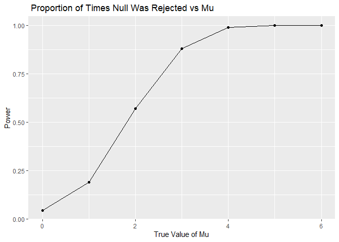
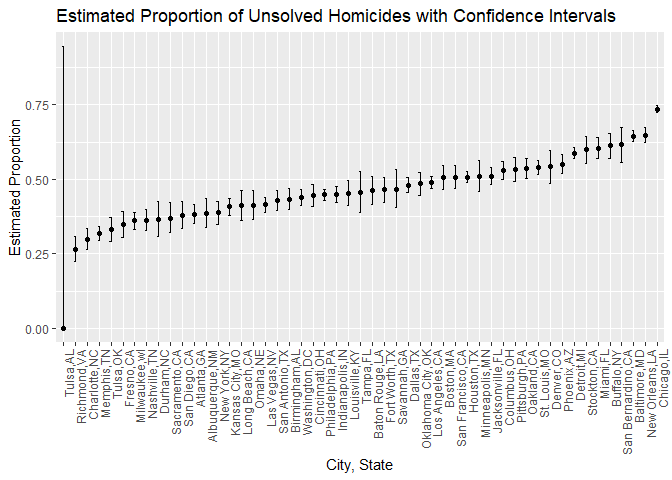

HW5
================
Sarahy Martinez
2024-11-05

``` r
library(tidyverse)
library(rvest)
library(stringr)
library(tibble)
library(patchwork)
```

# Problem 1

``` r
same_birthday = function(n) { 
  birthday = sample(1:365, n, replace = TRUE)
  return(length(birthday) != length(unique(birthday))) 
  }

n = 30 
results = same_birthday(n) 

# False -> all birthdays are unique , TRUE -> there are duplicate birthdays 
```

``` r
simulate_probabilities = function(group_size, num_simulations) {
  results = map(1:num_simulations, ~same_birthday(group_size))
  mean(unlist(results)) }

group_sizes = 2:50 
probabilities = map_dbl(group_sizes, ~simulate_probabilities(.x, 10000))


results_table = tibble(
  group_size = group_sizes, probability = probabilities)
```

``` r
ggplot( results_table, aes( x = group_size, y = probability)) + 
  geom_line() +
  geom_point()+
  labs (
    title = "Group Size vs Probaility of Same Birthday ",
    x = "Group Size",
    y = "Probability"
  )
```

<!-- -->

# Problem 2

## Problem 2a

``` r
sim_power= function(mu, n = 30, sigma = 5, datasets = 5000, alpha = 0.05) {  #defining the results
  results = replicate(datasets, { # use replicate to simulate the sampling of 5000 times
    x = rnorm(n, mean = mu, sd = sigma) # defining the variables 
    test = t.test(x, mu = 0)  # set mu to 0 
    broom::tidy(test)   # tidy the results 
  }, simplify = FALSE) 
  
  results_df = bind_rows(results)  # binding the results of the df
  
  power = mean(results_df$p.value < alpha)  # calculating power of the p-value 
  
  avg_mu_hat = mean(results_df$estimate)  # want the avg mu so take the mean across the estimates
  avg_mu_hat_rejected = mean(results_df$estimate[results_df$p.value < alpha])  # want the p value rejected of less than 0.05 and take the mean of that 
  
return(list(mu_hat = avg_mu_hat, power = power, avg_mu_hat_rejected = avg_mu_hat_rejected))  #mapping results above results to this 
  }


mu_values =0:6   #defining the values mu = 1,2,3,4,5,6 ; couldn't do (1,2,3,4,5,6) so did 0:6

results = vector("list", length(mu_values))   # mapping the list 

for( i in 1:length(mu_values)){   # for loop of the length for each iteration length  of the mu value 
  mu = mu_values[i]
  results[[i]] = sim_power(mu)

}

results_df = bind_rows(results) %>%   # binding the rows to have a tibble and then mutating mu to mu values 
  mutate(mu = mu_values)
```

## Problem 2B

``` r
ggplot( results_df, aes( x = mu, y = power)) +
  geom_line() + 
  geom_point()+
  labs (
    title = " Proportion of Times Null Was Rejected vs Mu",
    x = "True Value of Mu",
    y = "Power"
  )
```

<!-- -->
Based on the graph we can see that as effect size increases so does
power. There is a positive association until we reach mu=5 and mu =6
where power starts to plateau and even out. This association is true
because if we were to increase effect size this will allow for a type 1
error to occur ( rejecting the null when it should be failed).

## Problem 2C

``` r
mu_true = ggplot( results_df, aes( x = mu, y = mu_hat)) + 
  geom_line() + 
  geom_point()+
  labs (
    title = " Average Estimate of Mu hat vs True Value Mu",
    x = "True Value of Mu",
    y = "Avg estimate of Mu hat"
  )
```

``` r
mu_mu_rejected = ggplot( results_df, aes( x = mu, y = avg_mu_hat_rejected)) +
  geom_line() + 
  geom_point()+
  labs (
    title = " Average Estimate of Mu hat Rejected vs True Value Mu",
    x = "True Value of Mu",
    y = "Avg estimate of Mu hat rejected"
  )
```

Overlaying the graphs

``` r
(mu_true/ mu_mu_rejected) # patchwork to overlay?
```

<!-- -->

The plot of the average estimate of mu hat vs mu demonstrates a positive
linear relationship, as true value of mu increases so does the average
estimate of mu hat. For the second plot of the Average Estimate of Mu
hat rejected vs the true mu we can see that there is also a positive
association however their trends differ. For instance, from 0-1 the true
value of mu increases linearly but after that it begins to increase
exponentially at 2 and on wards. Lastly, we conclude that the sample
average of mu hat across the tests for which the null is rejected is
approximately equal to the true value of mu because of there is somewhat
of a linear relationship. If the linear relationship were to be full
linear then the slopes would be the same and they would be equal to each
other however in this graph it starts linear from 0-1 and then increases
exponentially.

# Question 3

## Question 3A

``` r
homicide_raw_data = read.csv("./homicide-data.csv")


# do the raw and then add in a separate chunk.
```

The raw homicide data contains 12 variables and 52179 observations.
Additionally, the names of the variables of interest are uid,
reported_date, victim_last, victim_first, victim_race, victim_age,
victim_sex, city, state, lat, lon, disposition.

``` r
homicide = homicide_raw_data %>% 
  unite(city_state, city, state, sep = ",") %>% 
  group_by(city_state) %>% 
  summarise(
   total_homicides = n(),
   total_unsovled = sum(disposition!= "Closed by arrest") 
  )
```

The raw homicide data contains with city_state contains 12 variables and
52179 observations. Additionally, the names of the variables of interest
are uid, reported_date, victim_last, victim_first, victim_race,
victim_age, victim_sex, city, state, lat, lon, disposition.

## Problem 3B

``` r
# filtering for Baltimore, MD and creating total_homicide and total_solved variables again so object can be found
homicide_MD = homicide %>%
  filter(city_state == "Baltimore,MD") %>%
  summarise(
    total_homicides_MD = sum(total_homicides),
    total_unsolved_MD = sum(total_unsovled ))

# creating a new df with the proportion of homicide using prop.test  
prop_homicide_MD =   
prop.test( 
  x = homicide_MD$total_unsolved_MD ,
  n = homicide_MD$total_homicides_MD
  )

# we can broom::tidy the above df so we must broom tidy the df once the prop.test is executed.Here we use broom::tidy
prop_homicide_MD_tidy = broom::tidy(prop_homicide_MD)

# Pulling the estimated proportion and confidence intervals of the resulting df
estimated_proportion = pull(prop_homicide_MD_tidy , estimate)
lower_limit = pull(prop_homicide_MD_tidy , conf.low)
upper_limit = pull(prop_homicide_MD_tidy , conf.high)


# other way of doing it 

baltimore_homicide = homicide_raw_data %>% 
  unite(city_state, city, state, sep = ",") %>% 
  group_by(city_state) %>% 
  summarise(
   total_homicides = n(),
   total_unsovled = sum(disposition!= "Closed by arrest") 
  ) %>% 
  filter(city_state == "Baltimore,MD") %>% 
  rowwise() %>%  #to compute one row at a time
  mutate(
  test = list( prop.test (x = total_unsovled , n =  total_homicides)), # list will create object
  tidy_result = list(broom::tidy(test)),  # tidying up the test
  estimate = test$estimate,  #pulling the estimate and CI
  lower_limit = test$conf.int[1],
  upper_limit = test$conf.int[2]) %>% 
  unnest(c(estimate, lower_limit, upper_limit)) %>%  # unnest to return as a table
  select(city_state, estimate, lower_limit, upper_limit) # selecting the variables of interest
  
print(baltimore_homicide) # printing the final results for your reference
```

    ## # A tibble: 1 × 4
    ##   city_state   estimate lower_limit upper_limit
    ##   <chr>           <dbl>       <dbl>       <dbl>
    ## 1 Baltimore,MD    0.646       0.628       0.663

## Problem 3c

``` r
 all_cities = homicide_raw_data %>% 
  unite(city_state, city, state, sep = ",") %>% 
  group_by(city_state) %>% 
  summarise(
   total_homicides = n(),
   total_unsovled = sum(disposition!= "Closed by arrest") 
  ) %>% 
  mutate(
  test = map2( total_unsovled,total_homicides, ~ prop.test (.x, .y)), # applying map2 to each pair in proptest  
  tidy_result = map(test, broom::tidy),# cleaning the results of mapping
  estimate    = map_dbl(tidy_result, "estimate"), # use map_dbl to extract the estimate, upper and lower limits
  lower_limit = map_dbl(tidy_result, "conf.low"),
  upper_limit = map_dbl(tidy_result, "conf.high"))%>%
  select(city_state, estimate, lower_limit, upper_limit) %>%  #selecting only the variables of interest. 
  mutate(city_state = fct_reorder(city_state, estimate))
```

    ## Warning: There was 1 warning in `mutate()`.
    ## ℹ In argument: `test = map2(total_unsovled, total_homicides, ~prop.test(.x,
    ##   .y))`.
    ## Caused by warning in `prop.test()`:
    ## ! Chi-squared approximation may be incorrect

## Problem 3D

``` r
plot = ggplot(all_cities, aes(x = city_state, y = estimate, group=1 )) +  #want to connect the points and geom_line alone won't work so use group =1 so r can treat all the points as if they belonged to one group
  geom_line() + 
  geom_point() + 
  geom_errorbar(aes(ymin = lower_limit, ymax = upper_limit), width = 0.2) + 
  labs(title = "Estimated Proportion of Unsolved Homicides with Confidence Intervals", 
       x = "City, State", 
       y = "Estimated Proportion") +
  theme(axis.text.x = element_text(angle = 90, hjust = 1))


print(plot)  # so we can see the plot 
```

<!-- -->
From the graph we see that Tulsa, AL has the lowest proportion of
unsolved homicides and a very wide confidence interval. Then we can see
that Chicago, IL has the highest proportion of unsolved homicides and
this can be held true given that Chicago has a high crime and homicide
rate.
